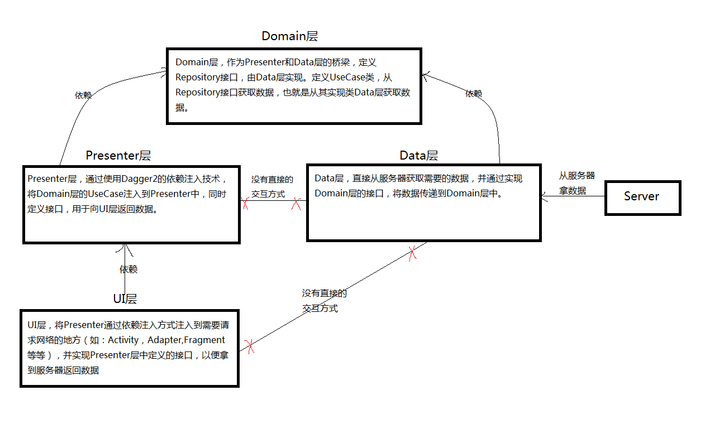

#SimpleMvp

使用MVP+Dagger+Rxjava+Retrofit+Lamada搭建的一个访问网络框架

## MVP介绍

### Domain层
作为Presenter和Data层的桥梁，定义Repository接口，由Data层实现。定义UseCase类，从Repository接口获取数据，也就是从其实现类Data层获取数据。

### Data层
依赖于Domain层，直接从服务器获取需要的数据，并通过实现Domain层的接口，将数据传递到Domain层中。

### Presenter层
依赖于Domain层，通过使用Dagger2的依赖注入技术，将Domain层的UseCase注入到Presenter中，同时定义接口，用于向UI层返回数据。

### UI层
依赖于Presenter层，将Presenter通过依赖注入方式注入到需要请求网络的地方（如：Activity，Adapter,Fragment等等），并实现Presenter层中定义的接口，以便拿到数据

